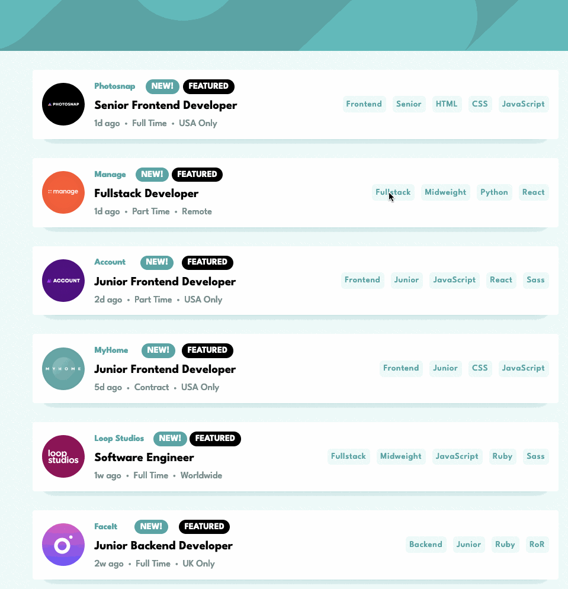

# Frontend Mentor - Job listings with filtering solution

This is a solution to the [Job listings with filtering challenge on Frontend Mentor](https://www.frontendmentor.io/challenges/job-listings-with-filtering-ivstIPCt). Frontend Mentor challenges help you improve your coding skills by building realistic projects. 

## Table of contents

- [Frontend Mentor - Job listings with filtering solution](#frontend-mentor---job-listings-with-filtering-solution)
  - [Table of contents](#table-of-contents)
  - [Overview](#overview)
    - [The challenge](#the-challenge)
    - [Screenshot](#screenshot)
    - [Links](#links)
  - [My process](#my-process)
    - [Built with](#built-with)
    - [What I learned](#what-i-learned)
    - [Continued development](#continued-development)
  - [Author](#author)

## Overview

### The challenge

Users should be able to:

&#9745; View the optimal layout for the site depending on their device's screen size

&#9745; See hover states for all interactive elements on the page

&#9745; Filter job listings based on the categories

### Screenshot

### Links

- Live Site URL: [Netlfiy](https://jakegodsall-joblisting.netlify.app/)

## My process

### Built with

- Semantic HTML5 markup
- CSS custom properties
- Flexbox
- Mobile-first workflow
- [React](https://reactjs.org/) - JS library
- [Styled Components](https://styled-components.com/) - For styles

### What I learned

This is the first project I have worked on using `React`. It was not a particularly difficult project, but has given me lots of practice sharing data between components (both up and down the component tree).

One significant challenge was to dynamically render the images from a absolute URL passed down through `props`. This was achieved by moving the image files into the `public` directory and accessing using the `PUBLIC_URL` environment variable. **Note** this project has been built with the `create-react-app` tool.

### Continued development

The most obvious thing to work on with the project is some smoother transitions when rendering components. When the `FilterBar` component is rendered the transition is quite ugly.

## Author

-   Website - [Jake Godsall](https://jakegodsall.com)
-   Frontend Mentor - [@jakegodsall](https://www.frontendmentor.io/profile/jakegodsall)
-   LinkedIn - [@godsalljake](https://www.linkedin.com/in/godsalljake/)
